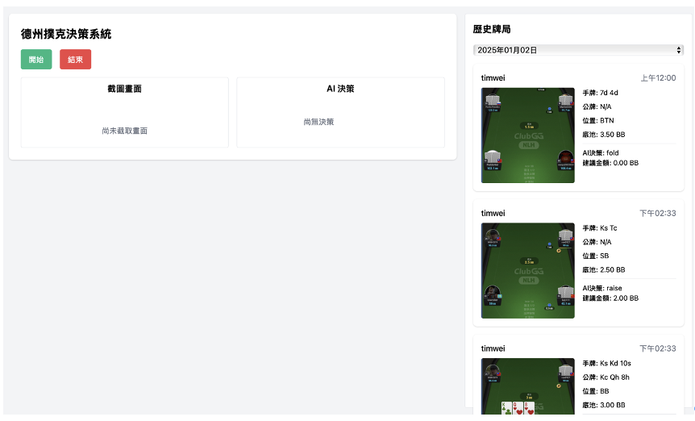
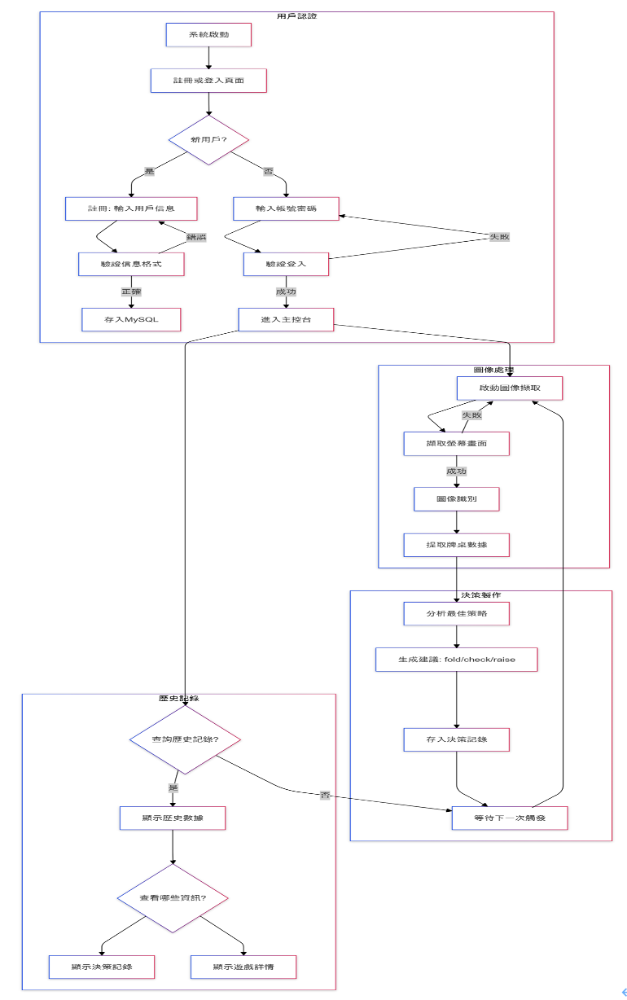
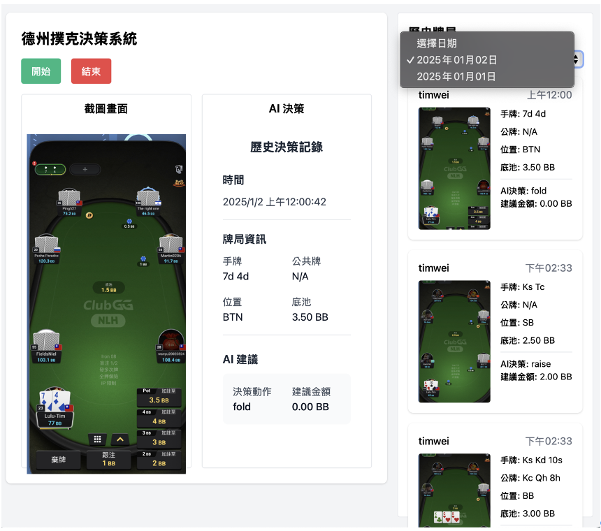
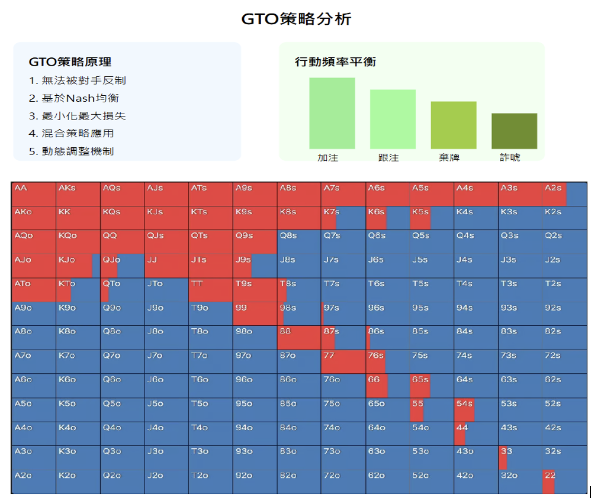
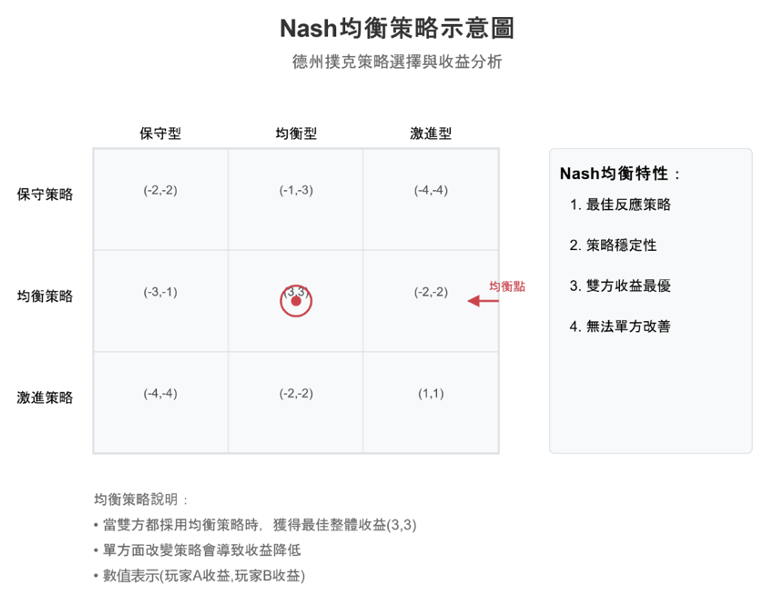
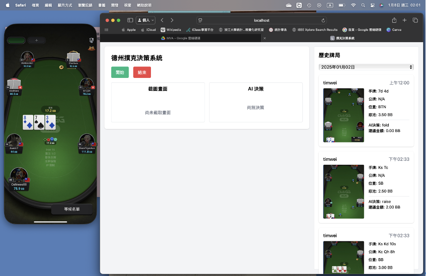

# 德州撲克 AI 決策輔助系統

本系統是一個創新的德州撲克輔助決策系統，結合了影像辨識技術與人工智慧分析，為線上撲克玩家提供即時的策略建議。透過深度學習技術，配合 GTO（Game Theory Optimal）理論，協助玩家在複雜的牌局中做出最佳決策。

## 研究背景與動機

隨著線上博弈市場的蓬勃發展，德州撲克已然成為一項重要的線上遊戲。然而，玩家面臨著即時決策的巨大挑戰，需要在短時間內處理大量資訊，往往導致決策品質下降。面對這些挑戰，我們透過人工智慧技術來改變現有的遊戲格局，提升玩家在面對撲克賽局時的競爭力。

本研究旨在打造創新的德州撲克 AI 輔助系統，為玩家提供即時且最佳的策略建議，不僅能提升玩家的決策品質與遊戲樂趣，更可作為人工智慧技術與實際應用整合的突破性案例。

## 系統架構

本系統採用三層式架構，確保系統的模組化特性與可維護性：

### 前端展示層
- 採用現代化網頁技術建構使用者介面
- 使用 WebSocket 實現即時通訊功能
- 提供流暢的操作體驗與即時策略回饋

### 後端邏輯層
- 整合 Node.js 後端伺服器
- 配置 Python 運算環境
- 處理複雜的運算需求和即時通訊

### 資料儲存層
E-R Model 設計圖展示了系統的資料結構：

## 系統功能說明

### 即時牌局分析
系統能夠即時分析當前牌局狀況，提供策略建議：

### GTO 策略分析
系統採用先進的 GTO 理論進行策略分析：

### Nash 均衡策略
系統整合了 Nash 均衡理論，確保策略的最佳化：

## 使用者介面

### 登入系統
系統提供直觀的登入介面：

### 註冊系統
新用戶可以通過註冊頁面建立帳號：

### 主要操作介面
系統的主要操作介面展示了即時牌局分析和策略建議：

### 主要功能操作

1. 系統啟動階段
   - 開啟線上德州撲克遊戲平台
   - 登入本輔助系統
   - 點擊「開始」按鈕啟動輔助功能

2. 即時操作階段
   - 按下空白鍵觸發影像擷取
   - 系統自動進行影像分析
   - 接收 AI 決策建議
   - 決策資訊自動儲存

3. 系統結束階段
   - 點擊「結束」按鈕
   - 確認資料保存完整
   - 可進行歷史記錄查看

## 開發技術與工具

### 核心技術
- Python：主要開發語言
- Node.js：後端伺服器
- MySQL：資料庫系統
- WebSocket：即時通訊協定

### 開發工具
- Visual Studio Code：程式碼編輯器
- MySQL Workbench：資料庫管理工具
- Git：版本控制系統

## 開發團隊

本專案由淡江大學統計學系數據科學碩士班開發：
- 魏祺紘：系統架構設計、AI 模型開發
- 李昇峰：資料庫設計、使用者介面開發

指導教授：高君豪 博士

## 未來展望

我們計劃在未來版本中進行下列改進：

### 跨平台支援擴展
- 支援 Windows 和 Linux 作業系統
- 開發行動裝置版本
- 優化系統資源使用效率

### 效能優化提升
- 改進影像處理算法
- 優化 AI 模型結構
- 強化系統並行處理能力

### 智能化升級
- 引入自適應學習機制
- 整合多種策略模型
- 開發個人化訓練模式

### 功能擴充
- 開發多人協作模式
- 加入策略分析工具
- 擴充數據分析功能

## 技術支援服務

如遇到技術問題，可透過以下管道尋求協助：
- 電子郵件支援
- 線上技術諮詢
- 系統更新服務

## 授權聲明

本專案為學術研究用途，著作權歸屬淡江大學統計學系數據科學碩士班，未經授權請勿商業使用。

---

*註：本系統開發目的在於學術研究，請遵守各線上撲克平台的使用規範。*
